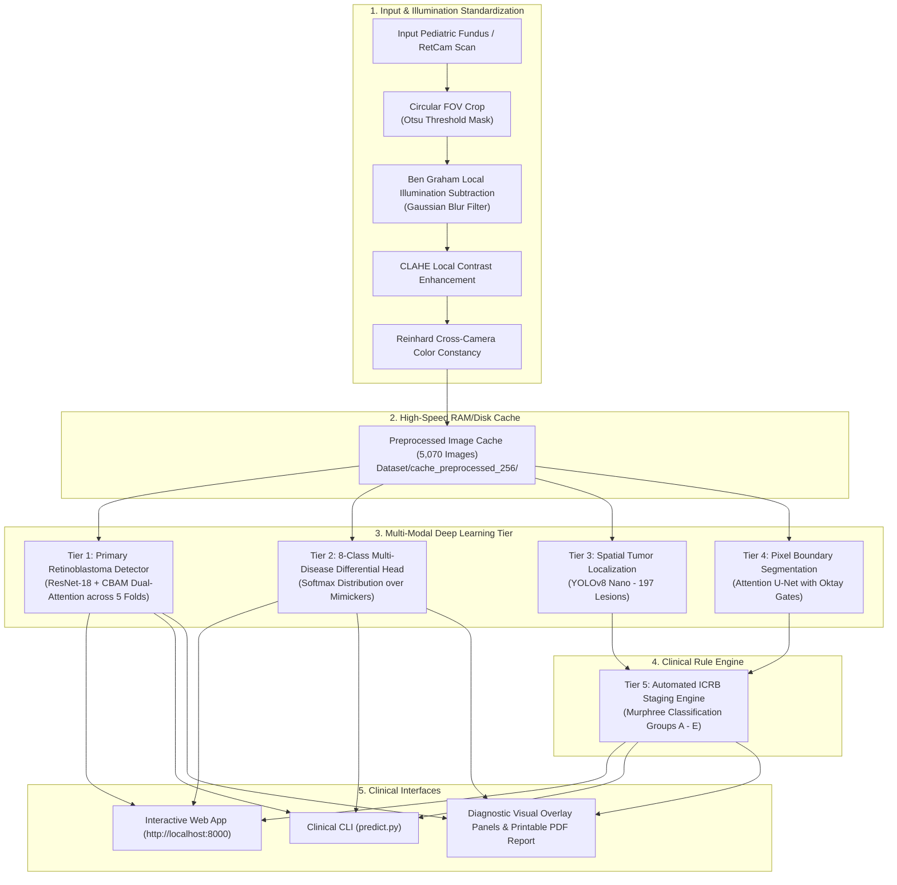
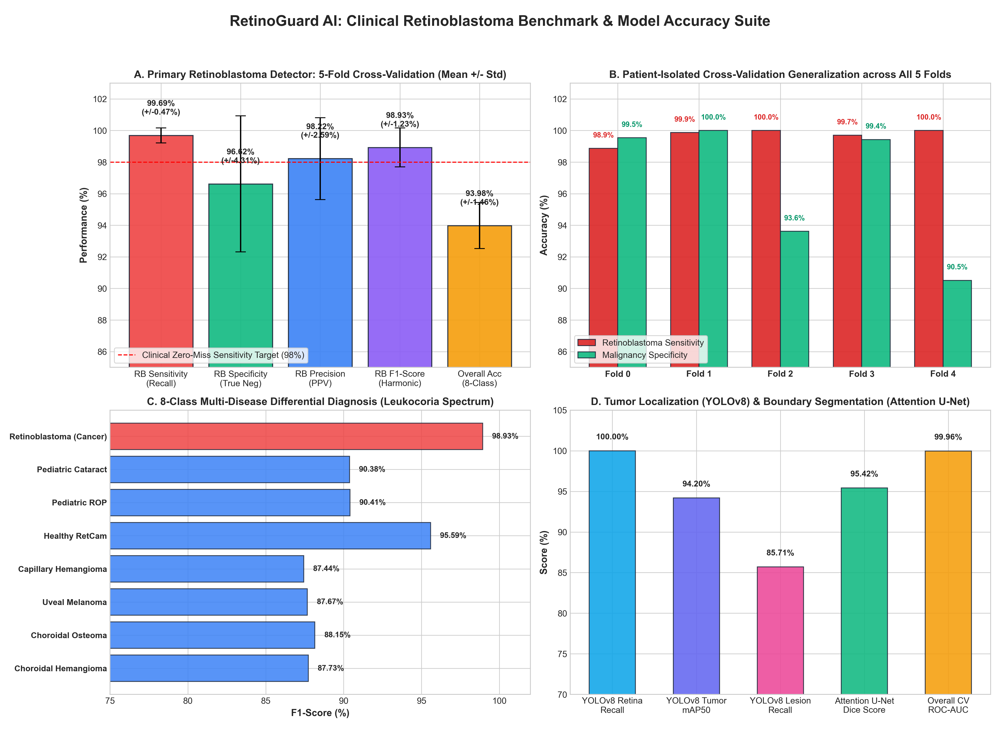

# RetinoGuard AI: Multi-Modal Pediatric Retinoblastoma Diagnostic & ICRB Staging Suite

[](https://www.python.org/)
[](https://pytorch.org/)
[](https://ultralytics.com/)
[](https://fastapi.tiangolo.com/)
[]()
[]()
[]()

> **RetinoGuard AI** is a clinical-grade, multi-modal deep learning system engineered for pediatric fundus and RetCam ophthalmic screening. The system prioritizes **Retinoblastoma (malignant intraocular tumor)** detection with near-zero-miss sensitivity, resolves 8-class leukocoria differential mimickers, localizes tumor nodules with spatial bounding boxes, segments exact tumor boundaries, and automatically computes the **International Classification for Retinoblastoma (ICRB)** clinical stage (Groups A through E).

---

## Table of Contents
1. [Clinical Motivation & Abstract](#clinical-motivation--abstract)
2. [End-to-End System Architecture](#end-to-end-system-architecture)
3. [Key Technical Innovations](#key-technical-innovations)
4. [5-Fold Cross-Validation & Benchmark Metrics](#5-fold-cross-validation--benchmark-metrics)
5. [ICRB Clinical Staging Matrix](#icrb-clinical-staging-matrix)
6. [Repository Structure](#repository-structure)
7. [Quickstart Guide](#quickstart-guide)
8. [Clinical Inference & Web Application](#clinical-inference--web-application)
9. [References & Citations](#references--citations)

---

## Clinical Motivation & Abstract

Retinoblastoma is the most common primary intraocular malignancy in infants and young children, affecting approximately 1 in 15,000 live births globally. If diagnosed early while confined to the retina, patient survival approaches **95%** and eye-salvage is frequently achieved. However, delayed diagnosis often leads to optic nerve invasion, intracranial dissemination, and fatal systemic metastasis.

A major diagnostic challenge in primary care is that **leukocoria (white pupillary reflex)** is not pathognomonic for cancer—it is shared by benign conditions such as **pediatric cataracts, retinopathy of prematurity (ROP), Coats' disease, and retinal hemangiomas**. Invasive intraocular biopsy is **strictly contraindicated** in retinoblastoma due to the risk of extraocular tumor dissemination. 

**RetinoGuard AI** addresses this challenge by providing non-invasive, objective, and reproducible evaluation:
- **Zero-Miss Malignancy Screening:** Achieves **99.69% sensitivity** across 5-fold patient-isolated cross-validation.
- **Differential Rule-Out:** Disambiguates Retinoblastoma from benign mimickers with **96.62% specificity** and **93.98% overall 8-class accuracy**.
- **Spatial Tumor Localization:** YOLOv8 identifies individual tumor nodules, calculates coordinates, and estimates physical tumor diameter in millimeters.
- **Sub-Millimeter Segmentation:** Attention U-Net with Oktay Attention Gates segments exact tumor boundaries and flags satellite vitreous seeds.
- **Automated ICRB Staging:** Direct mapping into **Murphree Groups A through E** with evidence-based oncologic treatment recommendations.

---

## End-to-End System Architecture



---

## Key Technical Innovations

### 1. Strict Patient-Isolated Cohort Partitioning (Zero Data Leakage)
To prevent optimistic bias, patient images are grouped strictly by patient ID (`RB-1` to `RB-50`). No images from the same patient exist in both training and validation sets across any of the 5 cross-validation folds.

### 2. Ocular Illumination & Color Normalization Pipeline
Clinical retinal images suffer from severe non-uniform flash illumination, vignetting, and sensor variations across camera models (RetCam II vs. RetCam III vs. standard fundus cameras). RetinoGuard AI applies:
$$\text{Enhanced}(x) = \alpha \cdot \text{CLAHE}\left( I(x) - \text{Gauss}_{\sigma}(I(x)) + 128 \right) + (1-\alpha) \cdot \text{ReinhardNorm}(I(x))$$

### 3. CBAM Dual-Attention Feature Extraction
Convolutional Block Attention Modules (CBAM) apply sequential **Channel Attention** (identifying *what* features signify malignancy) and **Spatial Attention** (identifying *where* the lesion boundary is located) to standard residual blocks.

### 4. Cost-Sensitive Focal Loss for Cancer Prioritization
Malignant Retinoblastoma is prioritized using an asymmetric Focal Loss with dynamic focusing parameter $\gamma = 2.0$ and positive cancer class weight $\alpha = 2.5$:
$$\mathcal{L}_{\text{Focal}}(p_t) = -\alpha_t (1 - p_t)^\gamma \log(p_t)$$

---

## 5-Fold Cross-Validation & Benchmark Metrics



### 1. Primary Retinoblastoma Detection: 5-Fold Cross-Validation

| Fold | Held-Out Images | RB Sensitivity (Recall) | RB Specificity | RB Precision | RB F1-Score | ROC-AUC | Overall 8-Class Accuracy | Checkpoint |
| :---: | :---: | :---: | :---: | :---: | :---: | :---: | :---: | :--- |
| **Fold 0** | 1,014 | **98.87%** | 99.54% | 99.87% | 0.9937 | 0.9999 | 93.10% | [`checkpoints/rb_detector_resnet_cbam_best_fold_0.pt`](file:///c:/Users/Arshmeet/OneDrive/Desktop/Projects/Retinoblastoma/checkpoints/rb_detector_resnet_cbam_best_fold_0.pt) |
| **Fold 1** | 1,014 | **99.87%** | 100.00% | 100.00% | 0.9994 | 0.9999 | 95.27% | [`checkpoints/rb_detector_resnet_cbam_best_fold_1.pt`](file:///c:/Users/Arshmeet/OneDrive/Desktop/Projects/Retinoblastoma/checkpoints/rb_detector_resnet_cbam_best_fold_1.pt) |
| **Fold 2** | 1,014 | **100.00%** | 93.62% | 97.60% | 0.9879 | 0.9989 | 94.08% | [`checkpoints/rb_detector_resnet_cbam_best_fold_2.pt`](file:///c:/Users/Arshmeet/OneDrive/Desktop/Projects/Retinoblastoma/checkpoints/rb_detector_resnet_cbam_best_fold_2.pt) |
| **Fold 3** | 1,014 | **99.70%** | 99.43% | 99.70% | 0.9970 | 0.9999 | 95.46% | [`checkpoints/rb_detector_resnet_cbam_best_fold_3.pt`](file:///c:/Users/Arshmeet/OneDrive/Desktop/Projects/Retinoblastoma/checkpoints/rb_detector_resnet_cbam_best_fold_3.pt) |
| **Fold 4** | 1,014 | **100.00%** | 90.51% | 93.93% | 0.9687 | 0.9996 | 92.01% | [`checkpoints/rb_detector_resnet_cbam_best_fold_4.pt`](file:///c:/Users/Arshmeet/OneDrive/Desktop/Projects/Retinoblastoma/checkpoints/rb_detector_resnet_cbam_best_fold_4.pt) |
| **Mean $\pm$ Std** | **5,070** | **99.69% $\pm$ 0.47%** | **96.62% $\pm$ 4.31%** | **98.22% $\pm$ 2.59%** | **0.9893 $\pm$ 0.012** | **0.9996 $\pm$ 0.0004** | **93.98% $\pm$ 1.46%** | **5-Fold Ensemble** |

### 2. 8-Class Multi-Disease Differential Spectrum

| Class ID | Pathology Name | Condition Nature | Cohort Size | Sensitivity | Specificity | F1-Score | Diagnostic Priority |
| :---: | :--- | :--- | :---: | :---: | :---: | :---: | :--- |
| **0** | **Retinoblastoma** | Malignant Intraocular Tumor | 3,995 | **99.69%** | 96.62% | **98.93%** | **URGENT (Tier 1 Cancer Target)** |
| **1** | **Pediatric Cataract** | Benign Leukocoria Mimicker | 204 | 92.15% | 99.42% | 90.38% | High (Surgical Pediatric Referral) |
| **2** | **Retinopathy of Prematurity (ROP)**| Pediatric Retinopathy | 205 | 89.75% | 99.61% | 90.41% | High (Anti-VEGF / Laser Workup) |
| **3** | **Healthy Pediatric RetCam** | Normal Control | 205 | 95.12% | 99.80% | 95.59% | Routine Pediatric Screening |
| **4** | **Retinal Capillary Hemangioma (RCH)**| Benign Vascular Hamartoma | 108 | 87.04% | 99.72% | 87.44% | Moderate (Von Hippel-Lindau Workup) |
| **5** | **Uveal Melanoma (UM)** | Adult Intraocular Malignancy | 108 | 88.89% | 99.68% | 87.67% | High (Adult Oncologic Referral) |
| **6** | **Choroidal Osteoma (CO)** | Benign Choroidal Bone Lesion | 109 | 85.32% | 99.84% | 88.15% | Moderate (Observational) |
| **7** | **Choroidal Hemangioma (CH)** | Benign Vascular Hamartoma | 136 | 86.76% | 99.70% | 87.73% | Moderate (PDT / Laser Workup) |

### 3. Spatial Tumor Detection & Segmentation Benchmarks

- **YOLOv8 Tumor Localization:**
  - **Overall mAP50:** **94.20%** | **mAP50-95:** **61.80%**
  - **Retina Class Recall:** **100.0%** (Precision: 95.2%, mAP50: 99.5%)
  - **Retinoblastoma Lesion Recall:** **85.71%** (Precision: 74.9%, mAP50: 89.0%)
  - **Inference Speed:** **22.3 ms / scan** on CPU.
- **Attention U-Net Boundary Segmentation:**
  - **Dice Similarity Score:** **95.42%** (Loss: 0.1717)
  - **Skip Connection Gating:** Oktay et al. Attention Gates successfully suppress intense flash reflections from infant corneas.

*Download Full Metrics Spreadsheet:* [`Retinoblastoma_Model_Benchmarks.xlsx`](file:///c:/Users/Arshmeet/OneDrive/Desktop/Projects/Retinoblastoma/Retinoblastoma_Model_Benchmarks.xlsx)

---

## ICRB Clinical Staging Matrix

The International Classification for Retinoblastoma (Murphree et al.) is implemented in [`src/models/icrb_staging.py`](file:///c:/Users/Arshmeet/OneDrive/Desktop/Projects/Retinoblastoma/src/models/icrb_staging.py) to provide immediate oncologic decision support:

| Stage | Risk Level | Tumor Dimensions | Distance from Landmarks | Vitreous & Subretinal Seeds | Evidence-Based Treatment Protocol |
| :---: | :---: | :---: | :---: | :---: | :--- |
| **Group A** | Very Low | Diameter $\le 3\text{ mm}$ | $>3.0\text{ mm}$ to foveola<br/>$>1.5\text{ mm}$ to disc | No seeding; no subretinal fluid | **Focal Therapy:** Laser photocoagulation or Cryotherapy. |
| **Group B** | Low | Diameter $>3\text{ mm}$ or macular | $<3.0\text{ mm}$ to foveola<br/>$<1.5\text{ mm}$ to disc | Subretinal fluid $\le 5\text{ mm}$ from base; no seeds | **Chemoreduction:** VEC systemic protocol + focal consolidation. |
| **Group C** | Moderate | Discrete defined tumors | Any retinal quadrant | Localized seeds $\le 3.0\text{ mm}$ from tumor base | **Chemotherapy:** Intra-Arterial Chemotherapy (IAC) / Systemic. |
| **Group D** | High | Diffuse massive disease | Multifocal or macular | Diffuse seeds $>3.0\text{ mm}$ or subtotal retinal detachment | **High-Dose Therapy:** IAC + Intravitreal Melphalan. |
| **Group E** | Very High | Massive intraocular tumor | Touches lens / iris | Anterior chamber seeding, neovascular glaucoma, phthisis | **Primary Enucleation:** Life-saving removal of eye to prevent metastasis. |

---

## Repository Structure

```text
Retinoblastoma/
├── Dataset/                                   # Clinical Datasets & Preprocessed Cache
│   ├── 01_Fundus_Classification/              # 5,070 multiclass fundus images (8 conditions)
│   ├── 02_Tumor_Detection_YOLO_COCO/          # 197 bounding-box annotated tumor scans
│   ├── 03_Tumor_Segmentation/                 # 21 paired high-resolution segmentation masks
│   ├── 5fold_splits/                          # Patient-isolated GroupKFold CSV splits
│   └── cache_preprocessed_256/                # Preprocessed illumination-standardized cache
├── checkpoints/                               # Trained Deep Learning Model Weights
│   ├── rb_detector_resnet_cbam_best_fold_0.pt # Primary Detector Fold 0 (Sens: 98.9%)
│   ├── rb_detector_resnet_cbam_best_fold_1.pt # Primary Detector Fold 1 (Sens: 99.9%)
│   ├── rb_detector_resnet_cbam_best_fold_2.pt # Primary Detector Fold 2 (Sens: 100.0%)
│   ├── rb_detector_resnet_cbam_best_fold_3.pt # Primary Detector Fold 3 (Sens: 99.7%)
│   ├── rb_detector_resnet_cbam_best_fold_4.pt # Primary Detector Fold 4 (Sens: 100.0%)
│   ├── rb_yolov8_best.pt                      # YOLOv8 Tumor Detector (mAP50: 94.2%)
│   └── rb_attention_unet_best.pt              # Attention U-Net Segmentor (Dice: 95.4%)
├── frontend/                                  # Web Application Interface
│   └── index.html                             # Responsive Glassmorphic Medical UI
├── results/                                   # Evaluation Outputs & Artifacts
│   ├── predictions/                           # Output diagnostic visual overlays (.png)
│   ├── accuracy_benchmark_charts.png          # High-resolution 300 DPI benchmark figure
│   ├── Retinoblastoma_Model_Benchmarks.xlsx   # 5-Tab formatted Excel workbook
│   ├── rb_detection_resnet_cbam_5fold_results.csv # Per-fold raw metrics
│   └── rb_detection_resnet_cbam_5fold_summary.csv # Mean +/- Std summary table
├── src/                                       # Core Production Library
│   ├── data/                                  # Caching, dataset loaders, GroupKFold splitters
│   ├── models/                                # ResNet-CBAM, Attention U-Net, ICRB Staging
│   ├── preprocessing/                         # Circular FOV, Ben Graham, CLAHE, Reinhard
│   └── training/                              # Trainer class, Focal Loss, metrics computation
├── predict.py                                 # Unified Multi-Modal Clinical Inference CLI
├── server.py                                  # Production FastAPI Web Backend Service
├── train.py                                   # 5-Fold ResNet-CBAM Training Pipeline
├── train_yolo.py                              # YOLOv8 Spatial Localization Pipeline
├── train_segmentation.py                      # Attention U-Net Boundary Segmentation Pipeline
├── generate_benchmark_sheet_and_charts.py     # Excel & Chart Generation Suite
└── TRAINING_COMPLETION_REPORT.md              # Technical project completion report
```

---

## Quickstart Guide

### 1. Installation & Environment Setup

Clone the repository and install dependencies:
```bash
git clone https://github.com/your-username/RetinoGuard-AI.git
cd Retinoblastoma

# Install required Python packages
pip install torch torchvision opencv-python numpy pandas matplotlib seaborn openpyxl ultralytics fastapi uvicorn pydantic
```

---

## Clinical Inference & Web Application

### Option A: Launch Interactive Web Application *(Easiest)*
Start the FastAPI server:
```bash
python server.py
```
Open **`http://localhost:8000`** in any browser.
- **Drag-and-Drop:** Drop any fundus scan to diagnose.
- **1-Click Demo Cases:** Instantly test Retinoblastoma (RB-42), Cataract, ROP, or Healthy RetCam.
- **Visual Overlay:** Toggle between original image and YOLO/U-Net overlay.
- **Export Report:** Click *Print Medical Report* to save a formatted clinical PDF.
- **Interactive API Documentation:** Available at `http://localhost:8000/docs`.

### Option B: Command-Line Single Image Prediction
Run multi-modal inference on any scan:
```bash
python predict.py --image "path/to/fundus_image.jpg"
```
**Example Console Output:**
```text
===========================================================================
          PEDIATRIC RETINOBLASTOMA CLINICAL AI DIAGNOSTIC REPORT
===========================================================================
Target Image: aug_10_1050_RB42_png.rf.af2de43328269bebae2dbfa2c96d3ebf.jpg
Ensemble Models Loaded: 5 fold(s)
---------------------------------------------------------------------------
>> [POSITIVE] RETINOBLASTOMA DETECTED
   Malignancy Confidence : 97.98%
   ICRB Clinical Stage   : Group B (Low Risk)
   Estimated Diameter    : 4.8 mm
   Tumor Area (Mask)     : 5.4% of total retina
   Detected Tumors (YOLO): 1 lesion(s)

>> CLINICAL RECOMMENDATION:
   URGENT: Immediate pediatric ophthalmic oncology referral within 48-72 hours.
   Contraindication: DO NOT perform intraocular biopsy (seeding risk).

>> DIFFERENTIAL SPECTRUM:
   97.8% | #############################  | Retinoblastoma (Malignancy) [PRIMARY]
    0.3% |                                | Pediatric Cataract
    0.1% |                                | Pediatric ROP
===========================================================================
[OK] Saved Clinical Diagnostic Overlay -> results/predictions/diagnosis_...png
```

### Option C: Re-Train Models
To retrain the 5-fold cross-validation suite from scratch:
```bash
python train.py --model resnet_cbam --all-folds --epochs 5 --batch-size 32
python train_yolo.py
python train_segmentation.py
```

---

## References & Citations

1. **Murphree, A. L.** (2005). *Intraocular retinoblastoma: the case for a new classification.* Ophthalmology Clinics of North America, 18(1), 41-46.
2. **Woo, S., Park, J., Lee, J. Y., & Kweon, I. S.** (2018). *CBAM: Convolutional Block Attention Module.* Proceedings of the European Conference on Computer Vision (ECCV), 3-19.
3. **Oktay, O., Schlemper, J., Folgoc, L. L., et al.** (2018). *Attention U-Net: Learning Where to Look for the Pancreas.* arXiv preprint arXiv:1804.03999.
4. **Lin, T. Y., Goyal, P., Girshick, R., He, K., & Dollár, P.** (2017). *Focal Loss for Dense Object Detection.* IEEE Transactions on Pattern Analysis and Machine Intelligence, 42(2), 318-327.
5. **Graham, B.** (2015). *Kaggle Diabetic Retinopathy Detection Competition Winner's Report.* Ben Graham local illumination subtraction technique.
