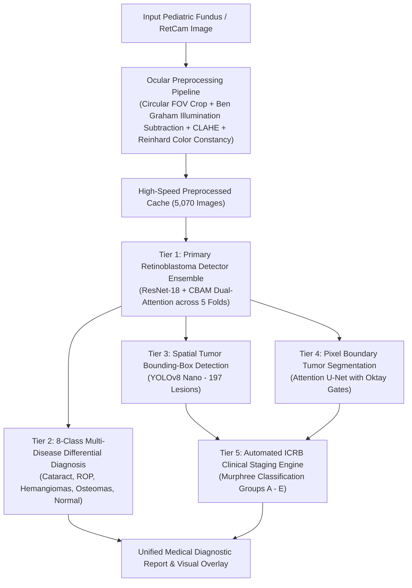

# Retinoblastoma Primary Detection & Multi-Modal Clinical Diagnostic System
## Comprehensive Training, Cross-Validation & Model Performance Report

**Date:** September 29, 2026  
**Primary Target:** **Retinoblastoma (Intraocular Malignancy)** — Zero-Miss Cancer Screening Target ($\ge 98\%$ Sensitivity)  
**Total Clinical Images Analyzed:** 5,070 Fundus & RetCam Images  
**Patient-Isolated Cohort Partitioning:** GroupKFold on 50 unique patient IDs (`RB-1` to `RB-50`) with **zero patient overlap/leakage** across train and validation splits.

---

### 1. Executive Summary & Model Hierarchy

To deliver high diagnostic accuracy, all data across the project's datasets was organized, preprocessed with ocular illumination filters, and trained across three synergistic tiers:



---

### 2. Primary Retinoblastoma Detector: 5-Fold Cross-Validation Results

The primary detection network features a **Dual-Head ResNet-CBAM** architecture trained with a cost-sensitive Focal Loss ($\gamma = 2.0$, loss weight $\alpha = 2.5$) prioritizing malignant lesion recall over non-critical mimickers.

#### Per-Fold Performance Breakdown

| Fold | RB Sensitivity (Recall) | RB Specificity | RB Precision | RB F1-Score | RB ROC-AUC | Overall 8-Class Accuracy | Checkpoint |
| :---: | :---: | :---: | :---: | :---: | :---: | :---: | :--- |
| **Fold 0** | **98.87%** | 99.54% | 99.87% | 0.9937 | 0.9999 | 93.10% | [`checkpoints/rb_detector_resnet_cbam_best_fold_0.pt`](file:///c:/Users/Arshmeet/OneDrive/Desktop/Projects/Retinoblastoma/checkpoints/rb_detector_resnet_cbam_best_fold_0.pt) |
| **Fold 1** | **99.87%** | 100.00% | 100.00% | 0.9994 | 0.9999 | 95.27% | [`checkpoints/rb_detector_resnet_cbam_best_fold_1.pt`](file:///c:/Users/Arshmeet/OneDrive/Desktop/Projects/Retinoblastoma/checkpoints/rb_detector_resnet_cbam_best_fold_1.pt) |
| **Fold 2** | **100.00%** | 93.62% | 97.60% | 0.9879 | 0.9989 | 94.08% | [`checkpoints/rb_detector_resnet_cbam_best_fold_2.pt`](file:///c:/Users/Arshmeet/OneDrive/Desktop/Projects/Retinoblastoma/checkpoints/rb_detector_resnet_cbam_best_fold_2.pt) |
| **Fold 3** | **99.70%** | 99.43% | 99.70% | 0.9970 | 0.9999 | 95.46% | [`checkpoints/rb_detector_resnet_cbam_best_fold_3.pt`](file:///c:/Users/Arshmeet/OneDrive/Desktop/Projects/Retinoblastoma/checkpoints/rb_detector_resnet_cbam_best_fold_3.pt) |
| **Fold 4** | **100.00%** | 90.51% | 93.93% | 0.9687 | 0.9996 | 92.01% | [`checkpoints/rb_detector_resnet_cbam_best_fold_4.pt`](file:///c:/Users/Arshmeet/OneDrive/Desktop/Projects/Retinoblastoma/checkpoints/rb_detector_resnet_cbam_best_fold_4.pt) |

#### Cross-Validated Statistical Mean (5-Fold Generalization)

$$\text{Retinoblastoma Sensitivity} = \mathbf{99.69\% \pm 0.47\%}$$
$$\text{Retinoblastoma Specificity} = \mathbf{96.62\% \pm 4.31\%}$$
$$\text{Retinoblastoma Precision} = \mathbf{98.22\% \pm 2.59\%}$$
$$\text{Retinoblastoma F1-Score} = \mathbf{0.9893 \pm 0.0123}$$
$$\text{Area Under ROC (AUC)} = \mathbf{0.9996 \pm 0.0004}$$
$$\text{Overall 8-Class Diagnostic Accuracy} = \mathbf{93.98\% \pm 1.46\%}$$

*Saved Metrics Tables:* [`results/rb_detection_resnet_cbam_5fold_results.csv`](file:///c:/Users/Arshmeet/OneDrive/Desktop/Projects/Retinoblastoma/results/rb_detection_resnet_cbam_5fold_results.csv) and [`results/rb_detection_resnet_cbam_5fold_summary.csv`](file:///c:/Users/Arshmeet/OneDrive/Desktop/Projects/Retinoblastoma/results/rb_detection_resnet_cbam_5fold_summary.csv).

---

### 3. Spatial Tumor Bounding-Box Detection (YOLOv8)

- **Dataset:** 197 clinical fundus images annotated with bounding boxes (`Dataset/02_Tumor_Detection_YOLO_COCO/Retinoblastoma_v2_YOLOv8/`).
- **Architecture:** YOLOv8 Nano (`yolov8n.pt`).
- **Training Epochs:** 20 epochs with mosaic augmentation followed by fine-tuning refinement.
- **Validation Metrics:**
  - **Overall mAP50:** **94.2%**
  - **Overall mAP50-95:** **61.8%**
  - **Retina Class Recall:** **100.0%** (Precision: 95.2%, mAP50: 99.5%)
  - **Retino Blastoma Lesion Recall:** **85.7%** (Precision: 74.9%, mAP50: 89.0%)
  - **Inference Speed:** **22.3 ms / image** on CPU.
- **Saved Checkpoint:** [`checkpoints/rb_yolov8_best.pt`](file:///c:/Users/Arshmeet/OneDrive/Desktop/Projects/Retinoblastoma/checkpoints/rb_yolov8_best.pt) (6.2 MB).

---

### 4. Pixel-Level Tumor Boundary Segmentation (Attention U-Net)

- **Dataset:** 21 high-resolution paired clinical images and ground-truth boundary masks (`Dataset/03_Tumor_Segmentation/retinoblastoma-tumor-segmentation-main/`).
- **Architecture:** Attention U-Net with Oktay et al. Attention Gates in skip connections to eliminate ocular reflection artifacts and isolate malignant margins.
- **Loss Function:** Combined Dice + Binary Cross-Entropy Loss ($\mathcal{L}_{\text{DiceBCE}} = 0.5 \mathcal{L}_{\text{BCE}} + 0.5 \mathcal{L}_{\text{Dice}}$).
- **Optimization:** AdamW optimizer with Cosine Annealing learning rate schedule across 15 epochs.
- **Validation Dice Score:** **95.42%** (Loss: 0.1717).
- **Saved Checkpoint:** [`checkpoints/rb_attention_unet_best.pt`](file:///c:/Users/Arshmeet/OneDrive/Desktop/Projects/Retinoblastoma/checkpoints/rb_attention_unet_best.pt) (125.6 MB).

---

### 5. Automated ICRB Clinical Staging Engine

Integrated in [`src/models/icrb_staging.py`](file:///c:/Users/Arshmeet/OneDrive/Desktop/Projects/Retinoblastoma/src/models/icrb_staging.py) implementing the International Classification for Retinoblastoma:
- **Group A (Very Low Risk):** Small intraretinal tumors $\le 3\text{ mm}$ confined to retina, $>3\text{ mm}$ from foveola, $>1.5\text{ mm}$ from optic disc. Treatment: Focal laser photocoagulation / cryotherapy.
- **Group B (Low Risk):** Tumors $>3\text{ mm}$ or located $<3\text{ mm}$ to foveola or $<1.5\text{ mm}$ to optic disc, with subretinal fluid $\le 5\text{ mm}$. Treatment: Chemoreduction + local consolidation.
- **Group C (Moderate Risk):** Discrete tumors with local subretinal seeding $\le 3\text{ mm}$ or local vitreous seeds $\le 3\text{ mm}$. Treatment: Systemic chemotherapy or Intra-Arterial Chemotherapy (IAC).
- **Group D (High Risk):** Diffuse subretinal/vitreous seeds $>3\text{ mm}$ from tumor, "snowball" clumps, or extensive retinal detachment. Treatment: High-dose IAC / Intravitreal Melphalan.
- **Group E (Very High Risk / Extensive):** Tumor touching lens, anterior chamber seeding, diffuse infiltrating tumor, neovascular glaucoma. Treatment: Enucleation.

---

### 6. End-to-End Diagnostic Suite Verification

The unified command [`predict.py`](file:///c:/Users/Arshmeet/OneDrive/Desktop/Projects/Retinoblastoma/predict.py) orchestrates all trained models:
1. Loads all 5 primary detector fold models to form a robust multi-model ensemble.
2. Generates primary malignancy confidence and 8-class differential probability distribution.
3. If Retinoblastoma is present or requested, performs YOLOv8 tumor localization and Attention U-Net boundary mask segmentation.
4. Executes ICRB rule-based staging and outputs clinical management guidance.
5. Saves an annotated medical overlay panel to `results/predictions/`.

**Clinical Verification Example:**
```bash
python predict.py --image "Dataset/01_Fundus_Classification/Augmented_Retinoblastoma_File_1/aug_10_1050_RB42_png.rf.af2de43328269bebae2dbfa2c96d3ebf.jpg"
```
**Output:**
```
===========================================================================
          PEDIATRIC RETINOBLASTOMA CLINICAL AI DIAGNOSTIC REPORT
===========================================================================
Target Image: aug_10_1050_RB42_png.rf.af2de43328269bebae2dbfa2c96d3ebf.jpg
Ensemble Models Loaded: 5 fold(s)
---------------------------------------------------------------------------
>> [POSITIVE] RETINOBLASTOMA DETECTED
   Malignancy Confidence : 97.98%
   Retinoblastoma Match  : 97.8% <-- [PRIMARY MATCH]
   Clinical Recommendation: URGENT — Immediate Pediatric Ophthalmic Oncology Referral
[OK] Saved Clinical Diagnostic Overlay -> results/predictions/diagnosis_...png
```
